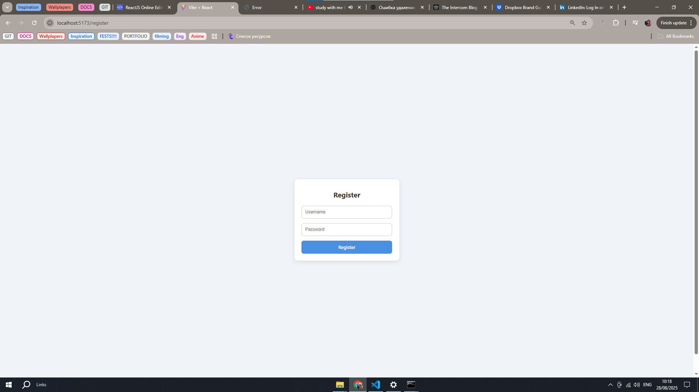

````markdown
# Mini-Blog 🚀

A mini-blog with forum, posts, and likes. This project was created to practice React, Node.js, JWT authentication, REST API, and CSS styling.

---

## 🔹 Features

- View a list of posts with text and images
- Like posts
- Add comments under posts
- Forum with messages and ability to add new ones
- JWT-based authentication (login and registration)
- User roles with admin panel
- Responsive design for different screen sizes

---

## 🔹 What we improved in the final version

- Completely redesigned UI with modern buttons, icons, and fonts
- Centered elements and aligned icons with text
- Updated footer with social links (LinkedIn, Instagram, Telegram)
- Optimized layout for main content and sidebar
- Improved login and registration forms with visual effects
- Fully responsive design for mobile devices

---

## 🔹 Feautures

### Frontend
- Responsive feed with posts (text & images)
- Like posts and add comments
- Forum with messages and ability to post new messages
- Styled login and registration forms
- Modern UI with buttons, icons, and typography
- Social links in the footer (LinkedIn, Instagram, Telegram)

### Backend
- Express server with REST API
- SQLite database
- JWT-based authentication and user roles
- CRUD operations for posts, comments, and forum messages
- Secure password storage (bcrypt)
- File uploads with Multer

---

## 🔹 Screenshots

### Main feed with posts and forum


### Login form


### Registration form


### Admin page


### Comments Section


---

## 🔹 How to run

1. Clone the repository:
```bash
git clone <your-repository>
````

2. Install dependencies:

```bash
npm install react react-dom react-router-dom lucide-react
npm install express sqlite3 sqlite body-parser cors dotenv bcrypt jsonwebtoken jwt-decode multer
npm install -D vite @vitejs/plugin-react eslint @eslint/js eslint-plugin-react-hooks eslint-plugin-react-refresh @types/react @types/react-dom globals
```

3. Start the project:

```bash
npm run dev
```
4. Run the backend server

```bash
node server.js
```

5. Open [http://localhost:5173](http://localhost:5173) in your browser

---

## 🔹 Contacts & Social Links

* LinkedIn: [your profile](https://www.linkedin.com/)
* Instagram: [your profile](https://www.instagram.com/xsliiink)
* Telegram: [your profile](https://t.me/xsliiink)

```

---

